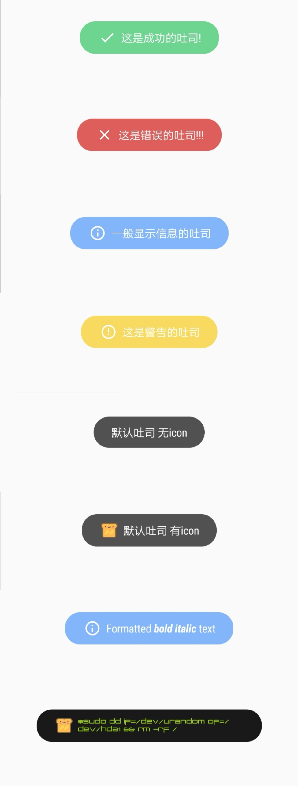

# Toasts

[](https://imgchr.com/i/VRUWB4)

## Gradle 设置

在项目的 `build.gradle` 里添加

```gradle
dependencies {
    implementation 'top.hasiy:toasts:1.0.1'
}
```

## 可选配置 Config 

```kotlin
Toasts.Config.getInstance()
                .tintIcon(false) // 可选项 是否将字体颜色应用到icon上
.setToastTypeface(Typeface.createFromAsset(this.assets, "PCap Terminal.otf")) // 可选项 设置字体
                .setTextSize(15) // 可选项 设置字体大小
                .allowQueue(false) // 可选项 是否Toasts 排队
                .apply()
```

You can reset the configuration by using `reset()` method:

```kotlin
Toasty.Config.reset()
```

## 使用

每个方法都会返回一个 toast 对象 

Demo

``` kotlin
Toasts.success(this, R.string.success_message, toastLength, true).show()
```
``` kotlin
Toasts.error(this, R.string.error_message, toastLength, true).show()
```
``` kotlin
Toasts.info(this, R.string.info_message, toastLength, true).show()
```
``` kotlin
Toasts.warning(this, R.string.warning_message, toastLength, true).show()
```
``` kotlin
Toasts.normal(this,R.string.normal_message_without_icon).show()
```
``` kotlin
Toasts.normal(this,R.string.normal_message_with_icon,ContextCompat.getDrawable(this, R.mipmap.toast)).show()
```
### 自定义 Toasts

``` kotlin
 Toasts.Config.getInstance()
                .tintIcon(false)  .setToastTypeface(Typeface.createFromAsset(this.assets, "PCap Terminal.otf")) 
                .setTextSize(15) 
                .allowQueue(false) 
                .apply()
            Toasts.custom(
                this, R.string.custom_message,
                ContextCompat.getDrawable(this, R.mipmap.toast),
                android.R.color.black, android.R.color.holo_green_light, toastLength, true, true
            ).show()
```
[](https://imgchr.com/i/VRBIlq)


